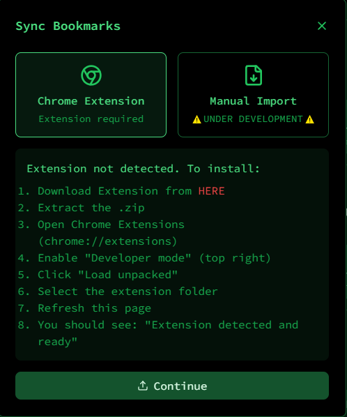

# Broccoli GitHub Creator 🥦


## LINK https://mprokolo.gr/

## Overview

Broccoli GitHub Creator is a web application that simplifies GitHub repository documentation and exploration. It provides an intuitive interface for browsing, documenting, and managing GitHub repositories.


## Features

- 🌱 GitHub Authentication
- 📂 Repository Browsing
- 📊 Repository Structure Visualization
- 📝 Markdown Documentation Generation
- 🥦Bookmark Library Management
- 🥦Sync Chrome Bookmark using Extention
- 🥦Updated github sync system
- 📤 Selective File Export
- 💚 Matrix-themed UI

## Screenshots





## Prerequisites

- Node.js (v18 or laters)
- npm or yarns
- GitHub Account

## Local Installation

1. 🌱 Clone the repository
```bash
git clone https://github.com/yourusername/mprokolo-lib.git
cd mprokolo-lib
```

2. 🌱 Create a GitHub OAuth App
- Go to GitHub Settings > Developer Settings > OAuth Apps
- Create a new OAuth App with:
  - Homepage URL: `http://localhost:3000`
  - Authorization callback URL: `http://localhost:3000/api/auth/callback`

3. 🌱 Create a `.env.local` file in the project root
```env
GITHUB_CLIENT_ID=your_github_client_id
GITHUB_CLIENT_SECRET=your_github_client_secret
NEXT_PUBLIC_APP_URL=http://localhost:3000
```

4. 🌱 Install dependencies
```bash
npm install
# or
yarn install
```

5. 🌱 Run the development server
```bash
npm run dev
# or
yarn dev
```

6. 🌱 Open `http://localhost:3000` in your browser

7. 🌱 Authenticate with github.

8. 🌱 Enjoy!

## Environment Variables

- `GITHUB_CLIENT_ID`: GitHub OAuth App Client ID
- `GITHUB_CLIENT_SECRET`: GitHub OAuth App Client Secret
- `NEXT_PUBLIC_APP_URL`: Your application's base URL

### Fallback Configuration

If you're having issues with environment variables not loading in your deployment, you can directly edit the values in `app/config.js`. This provides a fallback mechanism when environment variables don't work properly.

```js
// Edit this file directly if environment variables are not working
const config = {
  github: {
    clientId: process.env.GITHUB_CLIENT_ID || "your_github_client_id_here",
    clientSecret: process.env.GITHUB_CLIENT_SECRET || "your_github_client_secret_here",
  },
  app: {
    url: process.env.NEXT_PUBLIC_APP_URL || "https://mprokolo.gr",
  },
};
```

And on your deploy site

## Technologia

- Next.js 15
- React
- Tailwind CSS
- GitHub API
- Lucide React Icons

## Security

- Implements secure GitHub OAuth flow
- Uses HTTP-only cookies for token management
- Implements token-based authentication

## Contributing

1. Fork the repository
2. Create your feature branch (`git checkout -b feature/AmazingFeature`)
3. Commit your changes (`git commit -m 'Add some AmazingFeature'`)
4. Push to the branch (`git push origin feature/AmazingFeature`)
5. Open a Pull Request

## License

This software is free to use for personal and commercial purposes. However, redistribution, modification for distribution, or resale of this software or its components is strictly prohibited without explicit written permission from the author.

This software is provided "as is," without warranty of any kind.

## Contact

Your Name - pgpavlides@gmail.com
